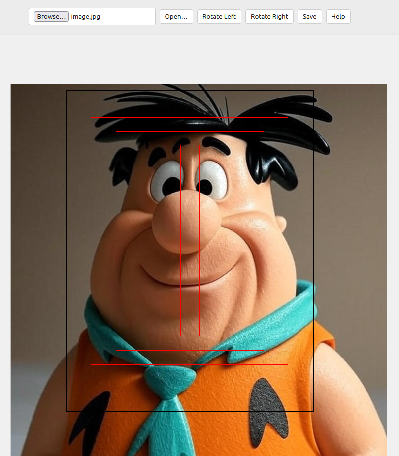

# Passport Photo Editor

## English
Passport Photo Editor is a free, open-source tool designed to help users prepare photographs that meet the strict requirements of the Finnish police for passports and other official documents. With this editor, you can easily open, rotate, and save images to ensure compliance with official guidelines, all without needing software that is often paid or does not meet Finnish requirements.

## Finnish (Suomi)
Passikuvaeditori on ilmainen, avoimen lähdekoodin työkalu, joka on suunniteltu auttamaan käyttäjiä valmistelemaan valokuvia, jotka täyttävät Suomen poliisin tiukat vaatimukset passeihin ja muihin virallisiin asiakirjoihin. Tämän editorin avulla voit helposti avata, kiertää ja tallentaa kuvia varmistaaksesi, että ne täyttävät viralliset ohjeet ilman ohjelmistoja, jotka ovat usein maksullisia tai eivät täytä suomalaisia vaatimuksia.

## Russian (Русский)
Редактор паспортных фотографий — это бесплатный инструмент с открытым исходным кодом, разработанный для подготовки фотографий, соответствующих строгим требованиям финской полиции для паспортов и других официальных документов. С помощью этого редактора вы можете легко открывать, поворачивать и сохранять изображения, чтобы они соответствовали официальным стандартам, без необходимости использования программ, которые чаще всего платные или не соответствуют финским требованиям.

## Features
- **Open**: Upload your photo to start editing.
- **Rotate Left/Right**: Adjust the orientation of your photo.
- **Save**: Download the edited photo in a format suitable for official use.
- **Help**: Access guidance on meeting Finnish passport photo requirements.

## Why This Tool?
Unlike other photo editing software, Passport Photo Editor is completely free and tailored specifically for creating compliant passport photos, making it accessible to everyone.

## How to Use
Visit the [Passport Photo Editor](https://your-username.github.io/passport-photo-editor) to start editing your photos directly in your browser. No installation or technical knowledge required!
